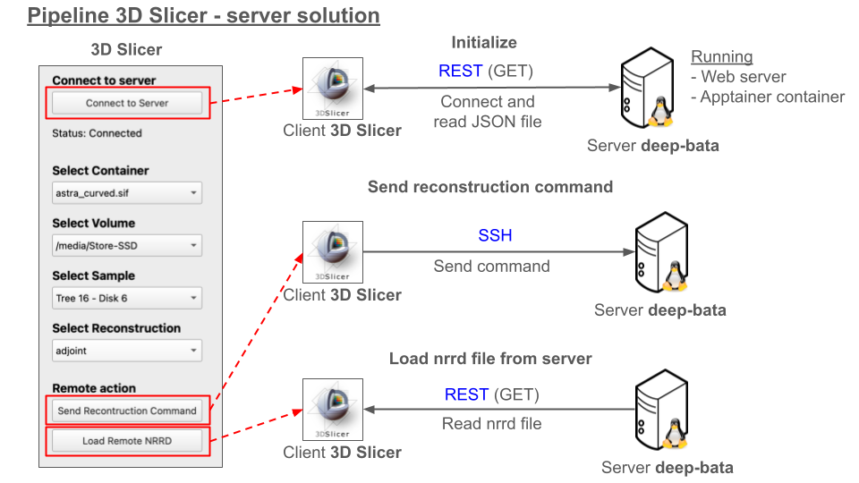

# Install the extension on 3D Slicer
## SinoReconsVisual2 Extension
SinoReconsVisual2 is a custom tool for 3D Slicer developed in Python.

The SinoReconsVisual2 extension enables users to interface with a remote server for sinogram reconstruction. Users can configure various parameters, including the container environment, volume, sample selection, and reconstruction algorithms along with their respective settings. Reconstruction commands, incorporating the selected parameters, are transmitted to the server via SSH. Upon completion, the resulting NRRD file is retrieved from the server and loaded into 3D Slicer through a REST API.

This extension has been developed with 3D Slicer version 5.6.2.

## Import the extension in 3D Slicer
 
**Load the Extension**:
   - Open 3D Slicer.
   - Go to the "Edit" menu and choose "Application Settings".
   - In the Application Settings, navigate to the "Modules" section.
   - In "Additional module path" section add the absolute path of the extension `/home/user/bata-vlai/src/3Dslicer/CT-Wood/CTWood/SinoReconsVisual2`. 
   - Click OK

**Restart 3D Slicer**:
   - Restart 3D Slicer to load the new extension. Ensure that the module path to the extension's folder is correctly set, so Slicer can recognize and load the extension.

**Verify the Extension**:
   - After restarting, check if the extension appears in the Modules drop-down menu under `/Utilities/SinoReconsVisual2`. This confirms that the extension is loaded.

# Server setup
For server setup please refer to https://github.com/LTU-WSE/bata-vlai/tree/main/src/CT_GUI_srv

# Pipeline 3D Sliver - server solution

