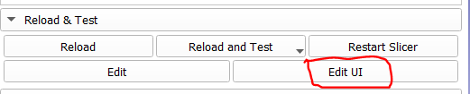
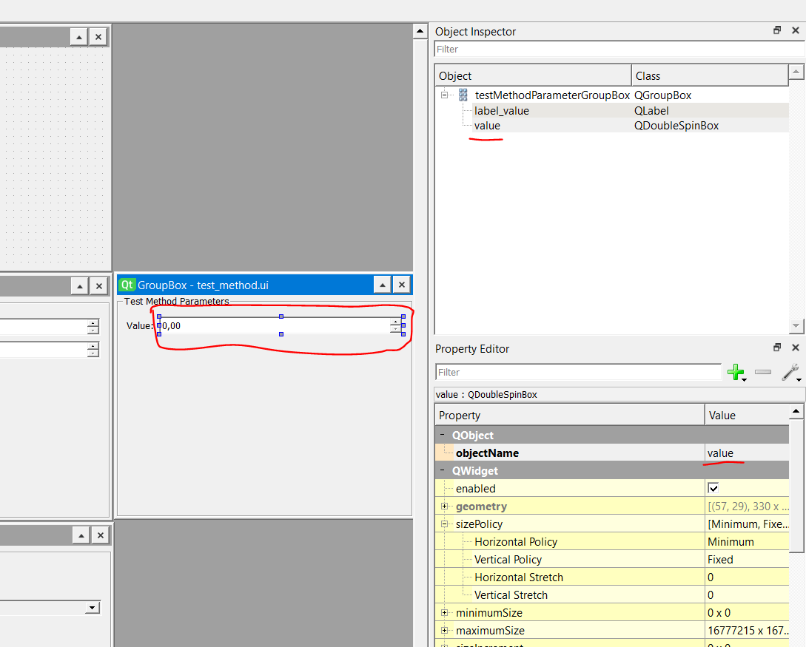

# Adding support for new reconstruction methods
This document serves as a step by step guide to adding support for new reconstruction methods. This guide can also be used to understand how to modify the available settings for existing reconstruction methods.

1. The first step to creating a new reconstruction method is to add a case for your reconstruction method in [reconstruction.py](../reconstruction.py) and implement the reconstruction method.

    To do this we need to add our method `test_method` to the argument parser like this.

    ```python
    parser.add_argument('--reconstruction_method', type=str, default='adjoint',
                        choices=['adjoint', 'fbp', 'landweber', 'test_method'], help="Reconstruction method to use")
    ```

    Then we add the implementation of the reconstruction method in the if elif else chain testing for our reconstruction method.
    ```python
    elif args.reconstruction_method == 'test_method':

        value = float(params.get('value', 0.5))

        A = sample['A']
        
        # Fill with random values between [0, value)
        reconstruction = A.domain.element(np.random.rand(*A.domain.zero().shape) * value)
    ```

2. The next step is to add the reconstruction method to [reconstruction_methods.json](../reconstruction_methods.json). It is important that the name of the reconstruction method is the same here as in [reconstruction.py](../reconstruction.py).

    In this file the name and parameters of the reconstruction method is defined. The name of the parameters defined here will be the parameters sent to [reconstruction.py](../reconstruction.py) so the names much match. In this case we define our `value` parameter.
    ```json
    {
        "reconstruction_methods": {
            ...
            {
                "name": "test_method",
                "parameters": {
                    "value": { "type": "QDoubleSpinBox", "value": { "min": 0, "max": 1, "default": 0.5, "step": 0.05 } }
                }
            }
        }
    }
    ```

3. Now we need to create the UI for our reconstruction method. We start this by copying [./3Dslicer/CT-Wood/CTWood/SinoReconsVisual2/Resources/UI/ReconstructionMethods/fbp.ui](../3Dslicer/CT-Wood/CTWood/SinoReconsVisual2/Resources/UI/ReconstructionMethods/fbp.ui) to a file called `test_method.ui` as a good starting point and place the file it in the [./3Dslicer/CT-Wood/CTWood/SinoReconsVisual2/Resources/UI/ReconstructionMethods/](../3Dslicer/CT-Wood/CTWood/SinoReconsVisual2/Resources/UI/ReconstructionMethods/) folder. The name `test_method.ui` must match the method name used before. 

    Using Qt Designer provided with Slicer is a convenient tool for creating the UI. 
    To get the "Edit UI" button you need to enable developer mode in the Slicer settings dialog.
    

    In Qt Designer you can add widgets corresponding to the parameters defined in [reconstruction_methods.json](../reconstruction_methods.json). It is important that the type of the widget (e.g. `QDoubleSpinBox`) and the name `value` maches the values defined in [reconstruction_methods.json](../reconstruction_methods.json).
    

4. Reload/restart slicer and the reconstruction method should now work.