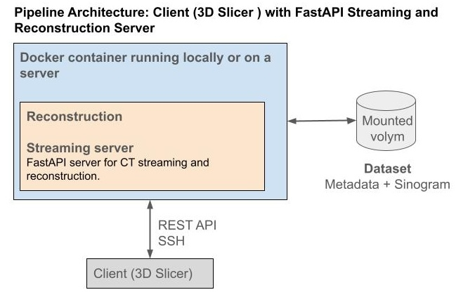

# CT Reconstruction & Streaming Server (MITO)

Tools for **loading MITO CT data**, **streaming acquisition geometry + sinogram slices**, and **reconstructing 3D volumes** (Adjoint, FBP, Landweber).  
Built on **ODL** (custom ASTRA curved branch), **ASTRA Toolbox (curved geometry)**, **FastAPI**, and **PyVista** (off-screen).

> Works with **3D Slicer** as a client, but you can also drive it via cURL or Python.

---

## Project Status

This repository is under active development — features, modules, and interfaces are continuously being updated and improved. Expect frequent changes and ongoing refinements.

## Architecture description

## Repository Structure

    .
    ├── README.md                   # This file
    ├── Dockerfile                  # The dockerfile
    ├── odl_stream_server.py        # FastAPI server for streaming geometry/sinogram slices and running reconstructions
    ├── reconstruction.py           # Standalone script to run reconstruction (adjoint, fbp, landweber)
    ├── reconstruction_methods.json # Defines a list of supported reconstruction methods. See [RECONSTRUCTION_GUIDE.md](./Documentation/RECONSTRUCTION_GUIDE.md) for a guide on how to add new reconstruction methods.
    ├── sample_config.json          # Sample list configuration.
    └── 3Dslicer/CT-Wood/CT-Wood/SinoReconsVisual2 # Slicer plugin

## Functionality Summary — odl_stream_server.py

-   Starts a **FastAPI server** for CT streaming and reconstruction.
-   **Loads CT sample data** (sinogram, angles, shifts, metadata) from the MITO dataset.
-   **Builds ODL cone-beam geometry** for the scan (source, detector, curvature, pitch).
-   Provides **API endpoints** to:
    -   /get_sinogram_slice/{index} → return a single projection as NRRD.
    -   /get_sinogram_slice_fast/{index} → return a single projection as JPEG2000 image.
    -   /full_trajectory.json → serve precomputed geometry and source paths.
    -   /select_sample → switch dataset (tree/disk).
    -   /run_reconstruction → execute reconstruction.py with chosen method (adjoint, FBP, Landweber).

-   **Saves outputs** (VTP, JSON, NRRD) to output/ and images/ directories.
-   Used by **3D Slicer** as a backend to visualize and reconstruct CT data dynamically.

## Functionality Summary — reconstruction.py

-   Reconstructs a **3D CT volume** from the **MITO dataset** for a specified tree and disk.

-   Currently supports **three reconstruction methods**, see [RECONSTRUCTION_GUIDE.md](./Documentation/RECONSTRUCTION_GUIDE.md):

    -   adjoint → simple backprojection (Aᵗb)

    -   fbp → filtered backprojection using ODL's fbp_op

    -   landweber → iterative gradient-based reconstruction (x ← x + ωAᵗ(b-Ax))

-   Accepts parameters such as number of iterations (niter) and relaxation factor (omega) via JSON.

-   Provides **verbose progress logging**, including iteration percentage for Landweber.

-   Optionally writes **progress updates to a JSONL file** (--progress_path).

-   Loads geometry and sinogram data from the **MITO dataset** via the dataset.MITO class.

-   Saves the reconstructed 3D volume as an **NRRD file** with correct voxel spacing metadata.

-   Designed for **integration with the FastAPI server** (odl_stream_server.py) to enable remote or containerized reconstruction.

## MITO Dataset Layout

Expected per-sample directory (bind-mounted read-only into the container):

    ├─ sinogram.npy            
    ├─ angles.npy              
    ├─ axial_positions.npy     
    ├─ shifts.npy              
    └─ metadata.json           

## Docker (CUDA 11.3 + cuDNN8)

This repo includes a Dockerfile that installs:

- Miniforge (conda-forge) with pinned numpy/pandas/matplotlib

- ASTRA Toolbox 2.1.3 (curved label)

- PyTorch 1.12.1+cu113

- VTK 9.2.6, FastAPI, PyVista, SciPy, pynrrd

- ODL custom branch: astra_cylcone_binding

## Clone the repository

    git clone https://github.com/ouaburst/CT_GUI_Docker.git

## Build

Inside the directory `CT_GUI_Docker/` type:

    docker build -t woodscan:cuda121 .

 ## Run the API server (GPU)   

    docker run --rm -it -p 8000:8000 \
     --gpus all \
     -v /media/Store-SSD:/media/Store-SSD:ro \
     woodscan:cuda121 \
     python -m uvicorn odl_stream_server:app --host 0.0.0.0 --port 8000

Notes:

-   **--rm**: Remove container after exit (keeps system clean).

-   **-it**: Interactive terminal (view logs in real time).

-   **-p 8000:8000**: Map container port 8000 → host port 8000 (<http://localhost:8000>).

-   **--gpus all**: Use all available GPUs (requires nvidia-container-toolkit).

    -   Limit to one GPU: --gpus '"device=0"' or -e CUDA_VISIBLE_DEVICES=0.

-   **-v /media/Store-SSD:/media/Store-SSD:ro**: Mount dataset (read-only).

-   **woodscan:cuda113**: Docker image (built with CUDA 12.1, ODL, ASTRA, FastAPI).

-   **python -m uvicorn odl_stream_server:app**: Runs the FastAPI server inside the container.

## API Endpoints ##

Root:

-   **GET /** --- status + usage hints

Geometry / Sinogram:

-   **GET /reconstruction_methods.json** --- a list of reconstruction methods the server supports

-   **GET /sample_conifg.json** --- a list of samples that can be used in POST /select_sample

-   **POST /select_sample** --- select a sample that other requests will query, must be an entry from GET /sample_config.json

-   **GET /full_geometry_npz** --- compact precomputed geometry numpy .npz file

-   **GET /get_sinogram_slice/{index}** --- one projection as .nrrd

-   **GET /get_sinogram_slice_fast/{index}** --- one projection as .jp2 (JPEG2000)

-   **POST /run_reconstruction** --- Run reconstruction

## License ##

MIT --- see \<LICENSE>.

## Acknowledgments ##

-   **ODL** team for operator framework

-   **ASTRA Toolbox** developers for GPU projectors